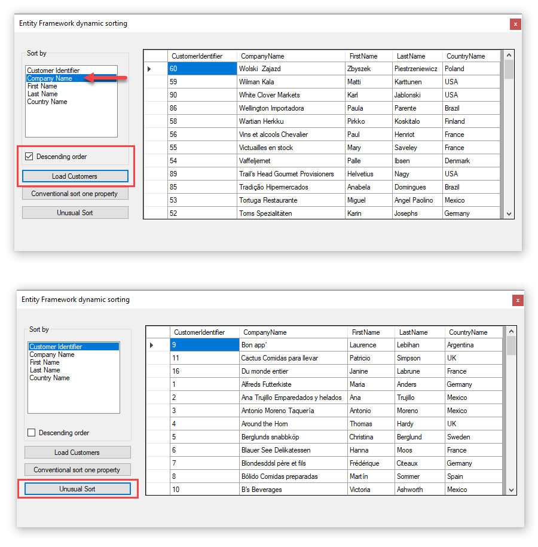
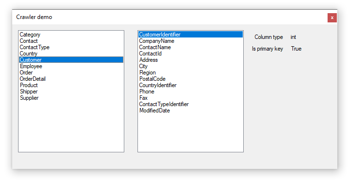

Code sample for dynamic sorting with Entity Framework in WinForms with VB.NET

Microsoft TechNet Wiki [article](https://social.technet.microsoft.com/wiki/contents/articles/53603.entity-framework-dynamic-order-by-vb-net.aspx)

---

#### Required

NuGet pakage [Equin.ApplicationFramework.BindingListView](https://www.nuget.org/packages/Equin.ApplicationFramework.BindingListView/)

Equin.ApplicationFramework.BindingListView GitHub [home page](https://github.com/waynebloss/BindingListView)

---

#### See also

[VB.NET Entity Framework: Wiki portal](https://social.technet.microsoft.com/wiki/contents/articles/53607.vb-net-entity-framework-wiki-portal.aspx)